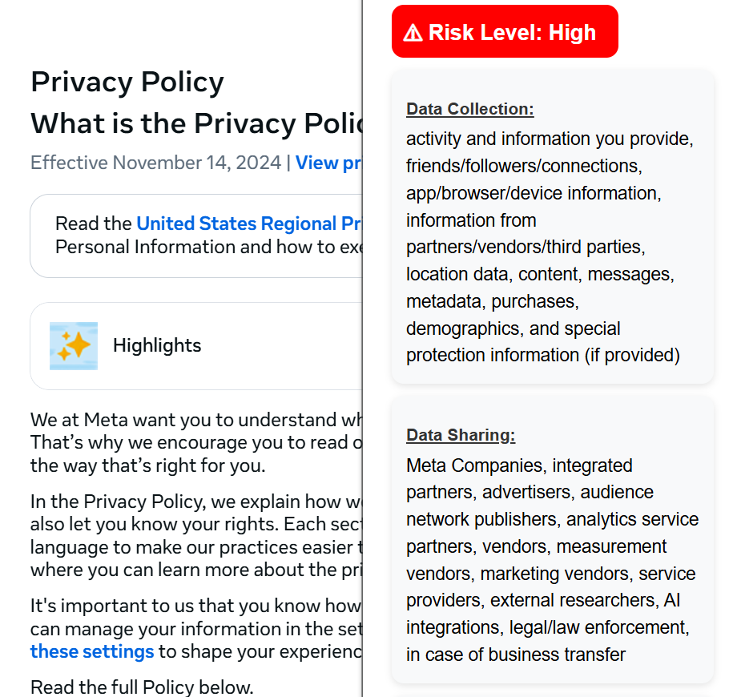

# Privacy Policy TL;DR - Chrome Extension
Privacy Policy TL;DR is a Chrome extension that summarizes website privacy policies into a short, readable format. It highlights the risk level, data collection, sharing, storage, and compliance info using Gemini's free API.

## Preview


## Features
- **Risk Level Classification:** High, Moderate, Low
- **Privacy Summary:** Organised into data collection, sharing, storage and compliances.

## Installation
1. Clone this repo.
2. Generate your Gemini API Key and create a ``secrets.json`` file in the root directory. Add the following code in that file.
```
{
    "GEMINI_API_KEY": "YOUR_KEY"
}
```
3. Open Chrome and go to ``chrome://extensions/``
4. Enable **Developer Mode** and click on **Load Unpacked**
5. Select the extension folder.

### Notes
The extension does not store any user data. Summaries depend on the quality of extracted policy text and the Gemini API output.   
